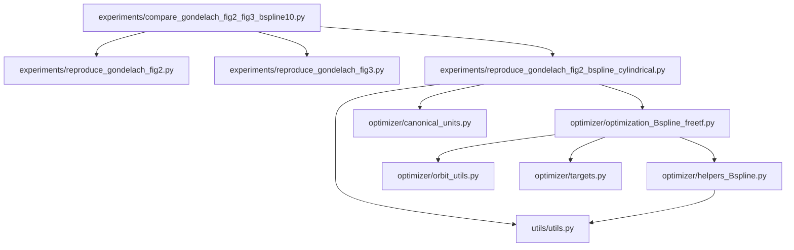

# FASTTRANSFER Architecture

## Current Scope

The active runnable workflow is the 20-day `compare_gondelach` study for Mars, Tempel 1, 1989 ML, and Mercury. Optimizer modules remain in `optimizer/` for later use, but their standalone scripts are not part of the current runnable surface.

## Dependency Map



## Active Entry Point

Use `experiments/compare_gondelach_fig2_fig3_bspline10.py` with one of these cases:

- `mars`
- `tempel1`
- `1989ml`
- `mercury`

Always pass the active grid settings:

```bash
--dep-step 20 --tof-step 20
```

Use `experiments/postprocess_compare_gondelach_plots.py` to redraw plots from
saved grids, Gondelach coefficients, and B-spline control points. Postprocessing
never launches an optimizer.

The active grids are defined only by inclusive minimum/maximum values and
`--dep-step`/`--tof-step`; count-based grid options are not supported.

## Kept Outputs

Only these generated comparison folders are retained:

- `output/compare_gondelach_mars_bspline10_dep20d_tof20d/`
- `output/compare_gondelach_tempel1_bspline10_dep20d_tof20d/`
- `output/compare_gondelach_1989ml_bspline10_dep20d_tof20d/`
- `output/compare_gondelach_mercury_bspline10_dep20d_tof20d/`

## Retained Optimizer Library

The direct/indirect optimizer modules are intentionally retained under `optimizer/` so they can be wired back into runnable scripts later without reconstructing the solver code.
